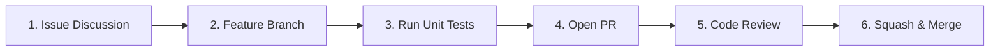

# Contributing to VoiceFlow

Thank you for your interest in contributing to **VoiceFlow**! We welcome contributions to our ultra-low latency voice agent and audio intelligence platform.

---

## 📜 Table of Contents

1. [Code of Conduct](#code-of-conduct)
2. [Licensing & Commercial Boundary](#licensing--commercial-boundary)
3. [Developer Certificate of Origin (DCO)](#developer-certificate-of-origin-dco)
4. [Contribution Workflow](#contribution-workflow)
5. [Audio & Real-Time Constraints](#audio--real-time-constraints)
6. [Local Development & Setup](#local-development--setup)
7. [Testing Standards](#testing-standards)
8. [Commit Message Standards](#commit-message-standards)
9. [Security & Vulnerability Disclosure](#security--vulnerability-disclosure)

---

## 🤝 Code of Conduct

We are committed to maintaining a welcoming, professional, and harassment-free community. Treat all contributors with mutual respect.

---

## ⚖️ Licensing & Commercial Boundary

VoiceFlow is licensed under the **GNU Affero General Public License v3.0 (AGPL-3.0)**.

- **Open Source Contributions**: All code submissions become available under the AGPL-3.0.
- **Commercial & Enterprise Licensing**: For proprietary telephony integration, closed-source on-premise deployments, or custom commercial distribution without AGPL-3.0 copyleft obligations, commercial licensing is provided via **OmniIntelOS**. See [`COMMERCIAL.md`](./COMMERCIAL.md) or reach out to `siddoyacinetech227@gmail.com`.

---

## ✍️ Developer Certificate of Origin (DCO)

All commits must include a sign-off certifying compliance with DCO 1.1:

```bash
git commit -s -m "feat(audio): downsample incoming PCM frames 24kHz to 16kHz"
```

---

## 🎧 Audio & Real-Time Constraints

When modifying audio ingestion or streaming pipelines:
- **Downsampling**: Inbound client audio (typically 24kHz WebRTC) must be downsampled to 16kHz before forwarding to live models.
- **Tool Call Audio Gating**: Audio input frames must be dropped while `is_tool_active = True` to prevent model echo and recursion.
- **WebSocket Protocols**: Follow standard binary PCM16 and JSON control frame specifications.

---

## 🔄 Contribution Workflow



1. **Issue First**: Open an issue before beginning substantial architecture or streaming changes.
2. **Branching**: Branch from `master` (`feat/feature-name` or `fix/bug-description`).
3. **Commit**: Sign off all commits and adhere to Conventional Commits.
4. **Pull Request**: Open a PR against `master` and ensure CI checks pass.

---

## 🛠️ Local Development & Setup

### Prerequisites
- Python 3.11+
- FFmpeg (for local audio transcode tests)
- Node.js 20+ (for frontend Voice Client)

### Environment Setup
```bash
# 1. Clone repository
git clone https://github.com/Yacine-ai-tech/VoiceFlow.git
cd VoiceFlow

# 2. Virtual environment setup
python3 -m venv venv
source venv/bin/activate

# 3. Install dependencies
pip install -e .
pip install -r requirements.txt

# 4. Configure environment
cp .env.example .env
```

---

## 🧪 Testing Standards

Run the test suite using pytest:

```bash
pytest tests/ -v
```

- Mock all live WebSocket connections and remote LLM providers in automated tests.
- Ensure audio downsampling and buffering helpers have high test coverage.

---

## 📝 Commit Message Standards

Use [Conventional Commits](https://www.conventionalcommits.org/):

`feat:`, `fix:`, `docs:`, `test:`, `refactor:`, `perf:`, `chore:`

---

## 🔒 Security & Vulnerability Disclosure

Report security vulnerabilities privately to `siddoyacinetech227@gmail.com`.
